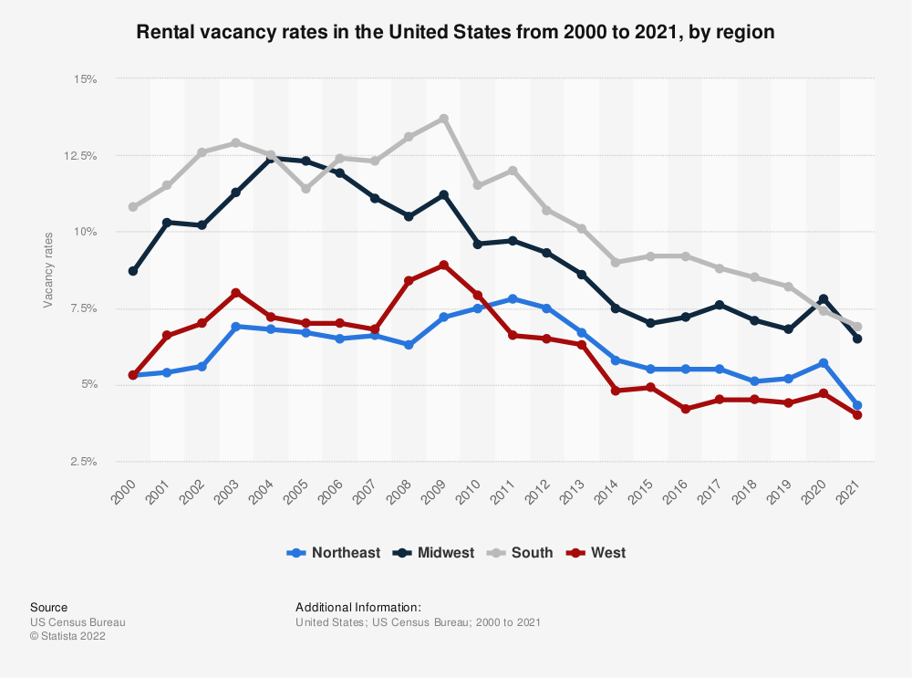

```{r setup, include=FALSE}
knitr::opts_chunk$set(echo = TRUE, cache = T, cache.lazy = FALSE) # notice cache=T here
knitr::opts_chunk$set(fig.height=4, fig.width=7, fig.align = 'center', warning = F)

if(!require('pacman')) {
  install.packages('pacman')
}
pacman::p_load(data.table, dplyr, tidyverse)
```

# Executive Summary

## Background

The US rental market has been growing rapidly growing over time, making it one of the most sought after areas for investment. Be it from small home owners to big private equity firms, everyone seems to be after housing, expecting the values of these houses to rise and supplement their income by renting these places. Many people consider that location is the "only important" factor responsible for a house's value and the rent that can be expected of it, but this is far from the truth. There are a lot of other factors that need to be considered for determining housing valuations as we see a huge variation in prices in houses located in the same vicinity. There must be something about these houses which is causing such a big price change. Hence we will be analyzing the data related to US Rental Listings in Summer of 2021, to find which of these factors, which consist of many in-house amenity components, impacts housing values the most. 

These amenities range from simple aka micro-factors like the availability of Pools and Dishwashers in the house to major aka macro-factors i.e. cities. The data will also give us the opportunity to find in which cities are these factors playing the most impact. With over 27,000 values for each predictor in our data, we have a sufficient sample size to make a reasonable conclusion regarding the price of these summer rentals. 

Graph: Rental vacancy rates in the United States from 2000 to 2021, by region (Source: Statista.com) 

This shows how the US housing market has been more sought after year by year, making housing a form of valuable investment. This increase in demand has already pushed up the prices. 
```{r pressure, echo=FALSE, fig.cap="A caption", out.width = '100%'}

```

## Description of Data

The data is gathered from Kaggle, a huge repository of community published code and data. This data was pulled from Rentler.com on 7/12/2021, 8/12/2021, and 9/6/2021, and population density data was scraped by zip code from mapszipcode.com on 7/12/2021. The pull from Rentler.com resulted in 4 CSV files which included the main rental listing, the list of amenities, the list of lease terms, and a list of who was responsible to pay each utility. Many of the variables that were sparsely populated were dropped before denormalizing the dataset. The rental listing information was joined with the population and population density information from mapszipcode.com (Source: Kaggle). Many of the data columns in the dataset are embedded in binary format with 0 representing the absence of the predictor attribute while 1, shows that the attribute is present. The data file is massive at around half a Gigabyte. Working with this size of data, we would have to use EDA or take a subset of the dataset for R to run effectively and not crash over the large size of the data. We will explore this idea in later sections. For now, the data is sufficient for analysis.

Our response variable is PRICE which represents the monthly price for the particular summer listing on rental.com.

## Summary of Findings

### Issues and Limitations

The biggest issue we initially faced was with respect to the file size which turned out to be quiet massive even for R Studio. The raw data we started with was half a gigabyte big which turned out to be very massive for any for of extrapolation. Hence we had to shorten the data out.......

# Exploratory Data Analysis

## Data Preprocessing/Cleaning

### Read the data

Firstly, we read the data from Kaggle - [US Rental Listings Summer 2021](https://www.kaggle.com/datasets/elizabethveillon/us-rental-listings-summer-2021)

```{r data, warning = FALSE, message = FALSE, results='hide'}
data <- fread("data/Rental_Properties.csv")
summary(data)
```

### Filter the data

The original dataset contains 276757 data, but we just need partial data. Before we randomly pick 20000 for further analysis, we can remove rows that is lack of important factors. The criteria is as follows

* sqft (squart feet) must be non-zero
* population and the density must be non-zero
* price must be non-zero

```{r read, warning = FALSE, message = FALSE, results='hide'}
data_filter <- data[(data$sqft!=0 & data$Population!=0),]
data_filter <-
  data_filter %>%
  drop_na(price)
set.seed(1)
data_20000 <- sample_n(data_filter, 20000)
```

Then we drop several columns which is clearly not helpful for predicting the rental price

* link
* street_address
* full_address

```{r drop, warning = FALSE, message = FALSE, results='hide'}
data_20000_filter <-
  data_20000 %>%
  select(-link, -street_address, -full_address)
```

Finally, we fill all NA with 0. The columns having NA is as follows

* pool
* dishwasher
* washer-dryer
* ac
* parking
* zip
* ZipCity

Then we export the cleaned dataframe to csv


```{r export, warning = FALSE, message = FALSE, results='hide'}
data_20000_filter[is.na(data_20000_filter)] <- 0
summary(data_20000_filter)

file_path <- "data/Rental_Properties_20000.csv"

if(!file.exists(file_path)) {
  write.csv(data_20000_filter, file_path)
} else {
  data_20000_filter <- fread(file_path)
}
```

## Data Transformations and Plots

```{r}
View(data_20000_filter)
```


# Model Training
```{r}

```


# Performance Analysis

# Conclusion

